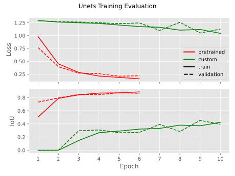
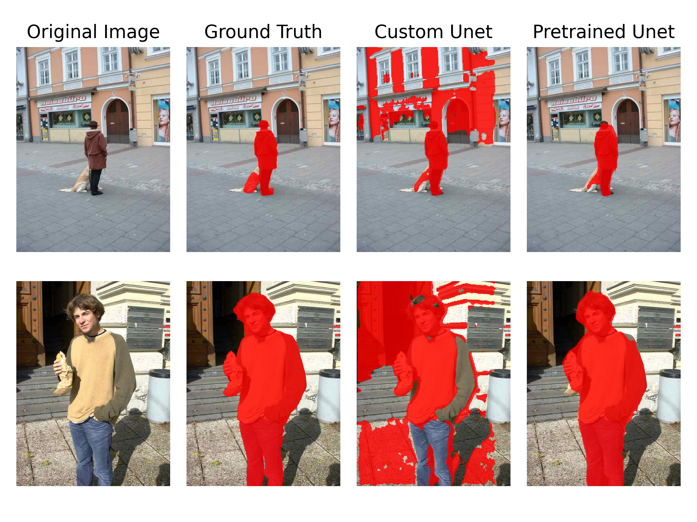

# U-Net

In this project I implement the [U-Net architecture](https://arxiv.org/abs/1505.04597) and compare it to a pretrained model from [PyTorch Segmentation Models](https://segmentation-modelspytorch.readthedocs.io/en/latest/).

The U-Net is designed for semantic segmentation, i.e. a task to assign a class to each pixel in an image. I use labeled training images with 2 classes: a person or not a person, which can be found [here](https://github.com/parth1620/Human-Segmentation-Dataset-master.git). Since the amount of data is small, a poor performance of a converged randomly initialized model is expected. This project focuses more on the implementation rather than the performance.

The general architecture proposed in the paper is as follows:


The network consists of an encoder and a decoder. The ecoder is a series of convolutional layers which process the image and produce high dimensional feature maps. The layers are interspersed with pooling layers that downsample the image. The decoder is then used to upsample the image and reconstruct its original dimensions. The key property of the U-Net is that it concatenates feature maps from opposing encoder and decoder layers. That way the network can preserve more of the spatial information and establish residual connections that improve the flow of gradients. In my project I use padded convolutions, thereby the output of each convolutional layer has the same height and width as the input. That way the shapes of the feature maps in opposing encoder and decoder layers have the same shape, therefore, cropping the feature maps before concatenation is not required. The final output of the model is a probability distribution over the classes for each pixel in the input image. Since we have only one class, for an input image of shape $H\times W \times 3$, the output is a $H\times W$ matrix with values in the range $[0,1]$, representing the probability of a person being in each pixel. Since each layer in the U-Net is a convolutional layer, the model can handle images with various dimensions.

The loss of the model is a combination of the Binary Cross Entropy loss and the Dice loss, defined respectively as follows:

$$\text{BCE}(\mathbf{y},\hat{\mathbf{y}}) = -\frac{1}{N}\sum_{i=1}^N\left[y_i\log(\hat{y}_i) + (1-y_i)\log(1-\hat{y}_i)\right]$$

$$\text{Dice}(\mathbf{y},\hat{\mathbf{y}}) = \frac{2\sum_{i=1}^Ny_i\hat{y}_i}{\sum_{i=1}^Ny_i^2+\sum_{i=1}^N\hat{y}^2}$$


Here $\mathbf{y}$ and $\hat{\mathbf{y}}$ are the flattened predicted probabilities and true labels respectively. BCE is commonly used for classification tasks, while the Dice loss resembles the intersection over union. In code the loss is defined as follows:

```python
import torch
import torch.nn as nn
from segmentation_models_pytorch.losses import DiceLoss

class UnetLoss(nn.Module):
    """The loss for the model: BCE + Dice"""

    def __init__(self) -> None:
        super(UnetLoss, self).__init__()
        self.bce_loss = nn.BCEWithLogitsLoss()
        self.dice_loss = DiceLoss(mode='binary')

    def forward(self, logits: torch.Tensor, masks: torch.Tensor) -> torch.Tensor:
        return self.bce_loss(logits, masks) + self.dice_loss(logits, masks)
```

The fundamental component of the U-net is the sequence $3\times 3\text{ Conv}\to\text{ReLU}\to3\times 3\text{ Conv}\to\text{ReLU}$, defined by 2 blue arrows after one another in the illustration above. In code this can be simply written as follows:

```python
class DoubleConv(nn.Module):
    """(3x3) conv -> ReLU -> (3x3) conv -> ReLU"""

    def __init__(self, in_channels: int, out_channels: int) -> None:
        
        super().__init__()
        self.conv1 = nn.Conv2d(in_channels, out_channels, kernel_size=3, padding='same')
        self.conv2 = nn.Conv2d(out_channels, out_channels, kernel_size=3, padding='same')
    
    def forward(self, x: torch.Tensor):
        return F.relu(self.conv2(F.relu(self.conv1(x))))
```

Essentially, the encoder is a sequence of `DoubleConv` modules interspersed with a $2\times 2$ max pooling. The decoder layers use a deconvolution (green arrow) and their input is concatenated with the feature map produced by the opposing encoder layer. It can be defined as follows:

```python
class Up(nn.Module):
    """Perform a deconvolution and concatenate with the output of the opposing layer"""

    def __init__(self, in_channels: int, out_channels: int) -> None:

        super().__init__()
        self.upconv = nn.ConvTranspose2d(in_channels=in_channels, out_channels=out_channels, kernel_size=2, stride=2)
        self.conv = DoubleConv(in_channels=in_channels, out_channels=out_channels)

    def forward(self, x_left: torch.Tensor, x_right: torch.Tensor) -> torch.Tensor:
        return self.conv(torch.cat((x_left, self.upconv(x_right)), dim=1))
```

Since the U-Net is a sequence of matching encoding and decoding layers, we can directly write the whole architecture as follows:

```python
class CustomUnet(nn.Module):

    def __init__(self, in_channels: int = 3, depth: int = 3, start_channels: int = 16) -> None:
        """Structure of the Unet. 
        Each layer in the decoder halves the image size in both dimensions and doubles the number of channels.
        The decoder layer is the opposite.
        """
        
        super().__init__()

        self.input_conv = DoubleConv(in_channels, start_channels)

        self.encoder_layers = nn.ModuleList()
        for i in range(depth):
            self.encoder_layers.append(DoubleConv(start_channels, start_channels * 2))
            start_channels *= 2
            
        self.decoder_layers = nn.ModuleList()
        for i in range(depth):
            self.decoder_layers.append(Up(start_channels, start_channels // 2))
            start_channels //= 2

        self.output_conv = nn.Conv2d(start_channels, 1, kernel_size=1)

    def forward(self, x: torch.Tensor) -> torch.Tensor:
        
        x = self.input_conv(x)
        xs = [x]

        for encoding_layer in self.encoder_layers:
            x = encoding_layer(F.max_pool2d(x, 2))
            xs.append(x)
            
        for decoding_layer, x_left in zip(self.decoder_layers, reversed(xs[:-1])):
            x = decoding_layer(x_left, x)

        return self.output_conv(x)
```

Here the filters of each consecutive encoder layer are doubled, while the filters of each decoder layer are halved. During training the mean loss and IoU are measured. The model's training performance compared to a pretrained model is visualized here: 



One can also investigate further in Tensorboard. Naturally, due to the limited data, the custom implementation overfits quickly and even before it stopped underfitting, therefore, its performance is poor. On the other hand, the pretrained model appears to learn the data well. The following shows the predictions of my model and the pretrained one on a random image that both models have never seen:



The custom implementation appears to be doing something right but the pretrained model is nearly perfect. A demo of both models is shown on [HuggingFace Spaces](https://huggingface.co/spaces/i4ata/CustomUnetSegmentation). The source code is available on [Github](https://github.com/i4ata/UnetSegmentation).

To train:

```python -m src.train```

To visualize training:

```tesnorboard --logdir runs```

To visually compare models on some examples:

```python -m src.evaluate```
